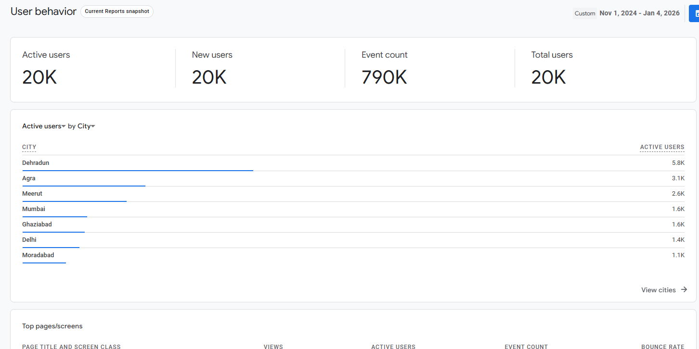

# 🎓 UniCheatSheet.com

> **A free, high-traffic academic platform built to help students focus on what truly matters for exams.**

- **UniCheatSheet** is a free, student-focused academic platform built and scaled to serve thousands of university students each semester
- The platform has handled **2M+ lifetime requests** and **500K+ requests per semester**
- Sustaining **50K+ daily requests during peak exam periods**, while delivering **professor-verified academic solutions** across multiple semesters
- UniCheatSheet was designed, deployed, and maintained with **end-to-end ownership**
- Later **open-sourced on GitHub**, enabling adoption by students from other universities

🗓 **Started:** October 2024  
👨‍💻 **Role:** Creator & Lead Developer  
🚀 **Status:** Actively maintained  

---

## 📑 Table of Contents

- [About UniCheatSheet](#-about-unicheatsheet)
- [User Navigation Flow](#-user-navigation-flow)
- [Key Features](#-key-features)
- [Platform Analytics & Scale](#-platform-analytics--scale)
- [Engineering & Ownership](#-engineering--ownership)
- [Collaboration with Local Businesses](#-collaboration-with-local-businesses)
- [No Google Ads. Ever.](#-no-google-ads-ever)
- [Growth & Sustainability](#-growth--sustainability)
- [Open Source](#-open-source)
- [License](#-license)

---

## 💡 About UniCheatSheet

Most students don’t need *more* content — they need the **right content**.

UniCheatSheet is built on the principle that:

> **20% of the effort can deliver 80% of the results.**

Instead of overwhelming students with lengthy textbooks and scattered resources, the platform
curates **exam-relevant material** that:
- Appears frequently in exams
- Aligns with professor expectations
- Maximizes marks per unit of study time

UniCheatSheet's goal is simple: **Help students (including myself) study smarter during high-pressure exam periods**.

---

## 🧭 User Navigation Flow

A high-level overview of how students interact with the platform.

---

## ✨ Key Features

- 📚 **Lecture Notes** for core university subjects
- ✅ **Solutions** for assignments, tutorial sheets, and practice problems
- 📝 **Previous Year Questions (PYQs)** for mid-semester and end-semester exams
- 🎓 **Multi-Semester Support** (Sem 1, Sem 2, Sem 3)
- 🔍 **Search Functionality** for quick access to content
- 📱 **Responsive Design** optimized for mobile, tablet, and desktop
- 🎨 **Clean, distraction-free UI**

---

## 📊 Platform Analytics & Scale

Since its launch in **October 2024**, UniCheatSheet has grown into a
**high-traffic, production-scale academic platform**.

### Key Metrics
- **2M+ lifetime requests**
- **500K+ requests per semester**
- **50K+ daily requests** during peak exam periods
- Thousands of students served every semester

The platform has consistently handled real-world academic traffic,
especially during exam seasons.

---

## 🏗️ Engineering & Ownership

UniCheatSheet was designed and built as a **production-grade web application** with full
end-to-end ownership — spanning development, deployment, analytics, and maintenance.

### Tech Stack
- **HTML5** — semantic, accessible markup
- **CSS3** — custom, responsive layouts with no UI frameworks
- **Vanilla JavaScript** — client-side logic and interactivity

### Analytics, Hosting & Infrastructure
- **Google Analytics** — traffic analysis and usage insights
- **Microsoft Clarity** — user behavior and interaction heatmaps
- **Hostinger** — website hosting and deployment
- **ImageKit & Cloudinary** — CDN-based image hosting and optimization

These choices were **intentional**:
- Minimal dependencies
- Fast load times
- Low operational overhead
- High reliability under traffic spikes

The entire codebase is **open-sourced on GitHub**, enabling transparency and reuse by
students from other universities.

---

## 🤝 Collaboration with Local Businesses

To keep the platform **free and independent**, UniCheatSheet implemented a
**cost-per-poster collaboration model** with local businesses.

### How It Worked
- Businesses were represented via **physical and digital posters**
- Each poster redirected users to:
  - Business websites
  - Google Maps locations
  - Contact or inquiry pages
- No advertisements appeared inside study flows

This approach:
- Generated **$100+ USD**
- Fully covered hosting and maintenance costs
- Preserved a **distraction-free academic experience**

---

## 🚫 No Google Ads. Ever.

UniCheatSheet is **not monetized in any form via Google Ads** — and never will be.

There are:
- ❌ No Google Ads  
- ❌ No pop-ups  
- ❌ No auto-playing banners  
- ❌ No distraction-driven monetization  
- ❌ **No paid subscriptions**

The guiding philosophy is simple:

> **If a student is willing to go out of their way to study,  
their focus should never be interrupted.**

And more importantly:

> **Knowledge should be free and accessible, not gated behind paywalls.**

For this reason, UniCheatSheet has **never introduced a subscription model**, even though it
was a viable revenue option. Every core feature remains freely accessible to all students.

Every design and monetization decision was made to **protect student attention and access**,
especially during high-pressure exam periods.

### Revenue Transparency

The platform intentionally prioritizes focus and accessibility over profit.  
As a result, revenue has always remained **minimal and secondary** to the student experience.

This was a deliberate choice to avoid intrusive monetization, even at the cost of
slower financial growth.

---

## 🌱 Growth & Sustainability

UniCheatSheet grew **organically from the ground up**, without paid marketing or external funding.

- Grown organically via **campus posters and word-of-mouth**
- No paid marketing campaigns
- No venture funding
- No exploitative monetization

The platform remains:
- Free for students
- Ethical by design
- Sustainable without compromising focus

---

## 🌍 Open Source

UniCheatSheet is open-sourced to:
- Encourage transparency and learning
- Enable reuse by other universities
- Serve as a real-world example of a scalable student platform

Contributions and forks are welcome.

---

## 📜 License

Released under the **MIT License**.

---

## ⭐ Final Note

UniCheatSheet represents:
- Product empathy
- Ethical engineering decisions
- Real-world scale
- End-to-end system ownership

If this project helped you, consider starring ⭐ the repository.

**Made with ❤️ for students, by students.**
